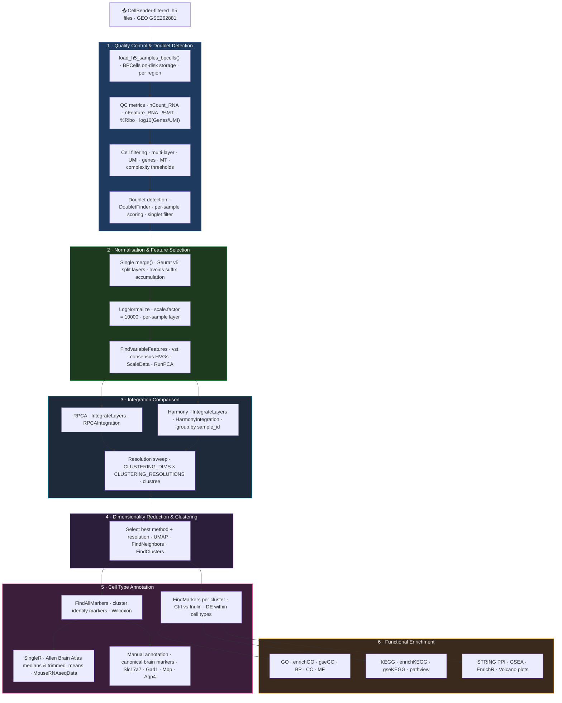

# snRNA-seq Analysis Pipeline

[](https://www.r-project.org/)
[](https://satijalab.org/seurat/)
[](https://bioconductor.org/)
[](https://rstudio.github.io/renv/)
[](#license)
[](https://slopezbegines.github.io/projects/single-cell/)

> Modular R pipeline for single-nucleus RNA-seq analysis: from CellBender-filtered 10X output through quality control, log-normalisation, RPCA/Harmony integration, doublet removal, clustering, differential expression, and multi-layered functional enrichment.

## Overview

End-to-end snRNA-seq pipeline built on Seurat v5. Applied to **GSE262881** (Wang et al., *BMC Biology* 2025) — a 5xFAD Alzheimer mouse model study examining the effect of dietary inulin supplementation across brain regions. The pipeline covers every analytical stage from CellBender-filtered CellRanger output to publication-ready figures and pathway enrichment reports, with BPCells on-disk matrix storage for memory-efficient processing on consumer hardware (16 GB RAM). Each stage is implemented as an independent modular script callable from Quarto/RMarkdown notebooks, enabling rapid adaptation to new datasets.

---

## Pipeline Architecture



---

## Repository Structure

```
.
├── README.md
├── renv.lock                          # Dependency lock file (R 4.5.2)
├── single_cell.Rproj                  # RStudio project
│
├── code/                              # Modular R scripts
│   ├── 00_packages.R                  # Dependency management (pak)
│   ├── 01_aux_functions.R             # Logging, RAM reporting, checkpoint utilities
│   ├── 02_sc_functions.R              # Core QC, BPCells loading, DoubletFinder, integration helpers
│   ├── 03_vulcano_plots.R             # Volcano plot generation per cluster
│   ├── 04_go_enrichment.R             # GO over-representation analysis (enrichGO)
│   ├── 05_string_network.R            # STRING PPI network retrieval and visualisation
│   ├── 06_gse_analysis.R              # GSEA ranked-list pipeline (gseGO)
│   ├── 06_Heatmap.R                   # ComplexHeatmap of top DEGs
│   ├── 08_EnrichR.R                   # Multi-library enrichment via enrichR
│   ├── heatmap.R                      # heatmap_de() / heatmap_mean() / heatmap_genes() helpers
│   ├── kegg_enrichment.R              # KEGG pathway GSEA + pathview
│   └── global_variables.R             # Thresholds & organism parameters
│
├── code_claude/                       # GSE194315 adaptation (PBMC CITE-seq reference)
│   ├── global_variables_GSE194315.R   # QC thresholds, PBMC markers, hardware config
│   ├── 00_packages_GSE194315.R        # Auto-install dependency loader
│   ├── 01_sc_functions_GSE194315.R    # Checkpoint system + extended QC utilities
│   └── GSE194315_PBMC_SCT_Analysis.Rmd  # Full analysis notebook for GSE194315
│
└── rmds/                              # Analysis notebooks
    ├── snRNAseq_pipeline.qmd          # ⭐ Active primary notebook (Quarto, in development)
    └── README.md                      # Notebook guide — which file to use and when
```

---

## R Scripts Reference

| Script | Purpose |
|---|---|
| `00_packages.R` | Install/load all dependencies via `pak` |
| `01_aux_functions.R` | `setup_logging()`, `ram_mb()`, `save_checkpoint()`, `load_checkpoint()`, `check_checkpoint()`, `save_table()`, `save_plot()` |
| `02_sc_functions.R` | `load_h5_samples_bpcells()`, `add_qc_metrics()`, `build_combined_meta()`, `run_doubletfinder_bp()`, `build_seurat_singlets()`, `n_pcs()` |
| `03_vulcano_plots.R` | `plot_volcano_clusters()` — ggplot2 volcano plots with ggrepel labels, one plot per cluster |
| `04_go_enrichment.R` | `run_go_enrichment()` — clusterProfiler GO over-representation (BP, CC, MF) per cluster |
| `05_string_network.R` | `run_string_network()` — STRINGdb PPI network retrieval and visualisation |
| `06_gse_analysis.R` | `run_gse_analysis()` — GSEA ranked-list pipeline (gseGO) |
| `07_Heatmap.R` | ComplexHeatmap of top DEGs per cluster |
| `08_EnrichR.R` | Multi-library enrichment via enrichR (GO, KEGG, Reactome, WikiPathways) |
| `heatmap.R` | `heatmap_de()`, `heatmap_mean()`, `heatmap_genes()` — flexible heatmap helpers |
| `kegg_enrichment.R` | `run_kegg_enrichment()` — enrichKEGG + gseKEGG with pathview pathway diagrams |
| `global_variables.R` | Centralised thresholds: `p_val`, `FC`, `QC_*`, `kegg_organism`, `species`, `CLUSTERING_DIMS`, `CLUSTERING_RESOLUTIONS` |

### Configuration (`global_variables.R`)

```r
p_val          <- 0.05          # Adjusted p-value threshold
FC             <- 0.25          # log2FC threshold for DE filtering
kegg_organism  <- "mmu"         # KEGG organism code (mouse)
species        <- 10090         # NCBI taxonomy ID (Mus musculus)
organism       <- "org.Mm.eg.db"
keyType        <- "SYMBOL"      # Gene ID format in data

# QC thresholds — tune per tissue
QC_MIN_FEATURES     <- 500
QC_MAX_FEATURES     <- 6000
QC_MIN_COUNTS       <- 1000
QC_MAX_COUNTS       <- 50000
QC_MAX_MT           <- 0.2     # Adjust to 0.01–0.05 for brain snRNA-seq
QC_MIN_COMPLEXITY   <- 0.80

# Integration & clustering
N_INTEGRATION_FEATURES <- 2000
CLUSTERING_DIMS        <- c(10, 20, 30)
CLUSTERING_RESOLUTIONS <- c(0.1, 0.2, 0.4, 0.8)
```

---

## Reproducing the Analysis

### 1. Restore the R environment

```r
install.packages("renv")
renv::restore()   # Restores all packages from renv.lock (R 4.5.2)
```

### 2. Run the pipeline

Open `rmds/snRNAseq_pipeline.qmd` in RStudio or VS Code. Set `DATA_DIR` and `output_path` in the setup chunk to point at your CellBender-filtered `.h5` files. Render via Quarto:

```bash
quarto render rmds/snRNAseq_pipeline.qmd
```

Or run interactively in RStudio chunk-by-chunk. The checkpoint system means any interrupted run restarts from the last completed step.

### 3. Run enrichment modules independently

After the main notebook produces `cluster_markers_by_condition`, source enrichment scripts directly:

```r
source("code/04_go_enrichment.R")   # GO over-representation
source("code/06_gse_analysis.R")    # GSEA
source("code/kegg_enrichment.R")    # KEGG pathway analysis + pathview
source("code/05_string_network.R")  # STRING PPI networks
source("code/08_EnrichR.R")         # EnrichR multi-database
```

> Raw data and processed Seurat objects are not versioned. The `renv.lock` file fully specifies the computational environment.

---

## Dataset — GSE262881

**Study:** A single-cell transcriptomic atlas of all cell types in the brain of 5xFAD Alzheimer mice in response to dietary inulin supplementation.
**Reference:** Wang et al. *BMC Biology* **23**, 124 (2025). doi:[10.1186/s12915-025-02230-x](https://doi.org/10.1186/s12915-025-02230-x)
**GEO accession:** [GSE262881](https://www.ncbi.nlm.nih.gov/geo/query/acc.cgi?acc=GSE262881)
**Design:** 5xFAD transgenic mice (Alzheimer model) — Control vs. Inulin supplementation across multiple brain regions (Forebrain, Cerebellum, etc.).
**Species:** *Mus musculus* (KEGG: `mmu`, taxonomy: 10090, annotation: `org.Mm.eg.db`)
**Upstream processing:** FASTQ → CellRanger 7.1.0 → CellBender 0.2.2 → `.h5` files (available on GEO)

### Cell types identified (Forebrain)

| Cell type | Key markers |
|---|---|
| Excitatory neurons (ExN L2/3) | Slc17a7, Lamp5, Cux2 |
| Excitatory neurons (ExN L4) | Rorb, Cux1 |
| Excitatory neurons (ExN L4/5) | Tox, Hs3st2 |
| Excitatory neurons (ExN L5/6) | Tle4, Fexf2 |
| Inhibitory neurons (InN Pvalb) | Gad1, Pvalb |
| Inhibitory neurons (InN Sst) | Gad1, Sst |
| Inhibitory neurons (InN Vip) | Gad1, Vip |
| Oligodendrocytes | Plp1, Mbp |
| OPC | Cacng4 |
| Microglia | Siglech, Cx3cr1 |
| Astrocytes | Aqp4, Gfap |
| Vascular / SMC-Peri | Cldn5 |

### Downloading the data

```r
# GEOquery (recommended)
BiocManager::install("GEOquery")
GEOquery::getGEOSuppFiles("GSE262881", baseDir = "rawdata/")
```

Expected directory structure:
```
rawdata/GSE262881_RAW/
├── <sample>_forebrain_CellBender_feature_bc_matrix_filtered.h5
├── <sample>_cerebellum_CellBender_feature_bc_matrix_filtered.h5
└── ...
```

> Raw data is gitignored (`rawdata/` excluded). Only analysis code is versioned.

---
## QC Thresholds

Thresholds must be tuned per tissue type. The values below are defaults for **human PBMCs** (from `code_claude/global_variables_GSE194315.R`) and serve as starting-point reference.

| Metric | Parameter | Default (PBMC) | Notes |
|---|---|---|---|
| Min genes per cell | `QC_MIN_FEATURES` | 200 | Below this → empty droplet or low-quality cell |
| Max genes per cell | `QC_MAX_FEATURES` | 5 000 | Above this → likely doublet |
| Min UMI counts | `QC_MIN_COUNTS` | 500 | Below this → poor library complexity |
| Max UMI counts | `QC_MAX_COUNTS` | 25 000 | Above this → likely doublet |
| Max % mitochondrial | `QC_MAX_MT` | 0.20 % | PBMCs have cytoplasm → higher baseline than nuclei; brain snRNA-seq typically uses 1–5 % |
| Min complexity (log10 genes/UMI) | `QC_MIN_COMPLEXITY` | 0.80 | Novelty score; low = low-complexity / stressed cells |
| Max % ribosomal | `QC_MAX_RIBO` | 60 % | No strict lower bound; very high ribo% can indicate stressed cells |

**Tissue-specific guidance:**

- **Brain snRNA-seq (nuclei) — this pipeline:** `QC_MAX_MT` 1–5 %, `QC_MAX_FEATURES` 3 000–6 000 (nuclei capture fewer transcripts than whole cells; Wang et al. 2025 data are CellBender-filtered so ambient RNA is already reduced)
- **Tumour biopsies:** higher MT tolerance (10–25 %) due to hypoxic stress
- **Immune cells (PBMC):** standard values in table apply

All thresholds are centralised in `global_variables.R` (or the dataset-specific variant). Change them there — do not hardcode values in notebooks.

---

## Computational Requirements

Benchmarked on an i7-7560U (2 physical / 4 logical cores, 16 GB RAM + 16 GB swap, Ubuntu).

| Dataset size | RAM required | Approx. runtime | Notes |
|---|---|---|---|
| < 5 000 cells | 8 GB | 20–40 min | Standard laptop feasible |
| 5 000 – 20 000 cells | 16 GB | 1–3 h | Swap may be used during integration |
| 20 000 – 50 000 cells | 32 GB | 3–8 h | HPC recommended; use `plan("multisession")` |
| > 50 000 cells | 64 GB+ | 8–24 h | HPC required; consider sketch-based methods |

**Parallelisation** is controlled in `global_variables.R`:

```r
# Sequential (safe on ≤ 16 GB RAM, protects against fork overhead)
PARALLEL_WORKERS      <- 1
FUTURE_GLOBALS_MAX_MB <- 14000   # 14 GB global size limit for {future}
plan("sequential")

# Multi-session (use on ≥ 32 GB RAM)
PARALLEL_WORKERS <- 4
plan("multisession", workers = PARALLEL_WORKERS)
```

The `code_claude/01_sc_functions_GSE194315.R` implements a **checkpoint system** that saves intermediate Seurat objects to `output/RData/checkpoint_<step>.rds`. If the session crashes mid-run, restart from the last checkpoint rather than from scratch:

```r
# Restart from a specific checkpoint
seurat_obj <- check_checkpoint("03_filtered", base = output_path)
```

---

## Troubleshooting

**`Error: cannot allocate vector of size X Gb`**

Insufficient RAM. Options: (1) reduce `N_INTEGRATION_FEATURES` from 3000 to 1500–2000; (2) switch to `plan("sequential")`; (3) process samples in batches using `Clusters_splitted_libraries.R`; (4) use sketch-based integration (`SketchIntegration` in Seurat v5).

**`Seurat v5 API errors` (e.g. `object of class Assay5 cannot be coerced`)**

Seurat v5 changed the default assay class. Fix:
```r
seurat_obj[["RNA"]] <- as(seurat_obj[["RNA"]], "Assay")  # downgrade to v4 assay
# or set globally:
options(Seurat.object.assay.version = "v3")
```

**`scDblFinder: too few cells in sample X`**

Doublet detection requires ≥ 200 cells per sample. For very small libraries, skip doublet detection or set a lower `dbr` (expected doublet rate):
```r
sce <- scDblFinder(sce, dbr = 0.05, samples = sce$library)
```

**`Harmony / RPCA integration fails`**

Common cause: too few cells in one condition after QC filtering. Check cell counts per sample before integration. If a sample has < 100 cells, consider removing it from integration or using a more lenient QC threshold.

**`clusterProfiler: keys not found in OrgDb`**

Ensure `keyType` matches the gene identifier format in your data. For human PBMC data, use `keyType <- "SYMBOL"`. For mouse data with Ensembl IDs, use `keyType <- "ENSEMBL"`.

**`renv::restore()` fails on Seurat v5**

Seurat v5 has non-CRAN dependencies. If restore fails:
```r
remotes::install_github("satijalab/seurat", "seurat5")
renv::restore()  # retry remaining packages
```

---

## Tech Stack

| Layer | Tools |
|---|---|
| Single-cell framework | Seurat v5 |
| On-disk sparse storage | BPCells (memory-efficient processing on 16 GB RAM) |
| Upstream denoising | CellBender 0.2.2 (ambient RNA removal, applied by original authors) |
| Doublet detection | DoubletFinder (per-library, before integration) |
| Normalisation | LogNormalize (scale.factor = 10 000, per-sample split layers) |
| Integration | RPCA (`RPCAIntegration`) + Harmony (`HarmonyIntegration`) — compared side-by-side |
| Clustering optimisation | clustree — resolution sweep across CLUSTERING_DIMS × CLUSTERING_RESOLUTIONS |
| Cell type annotation | SingleR with Allen Brain Atlas (medians + trimmed means) + MouseRNAseqData; manual marker curation |
| Differential expression | FindMarkers (Ctrl vs Inulin per cluster), FindAllMarkers (cluster identity) — Wilcoxon |
| GO enrichment | clusterProfiler (enrichGO, gseGO) |
| KEGG analysis | clusterProfiler (enrichKEGG, gseKEGG), pathview |
| PPI networks | STRINGdb |
| Multi-database enrichment | enrichR |
| Visualisation | ggplot2, ComplexHeatmap, patchwork, clustree |
| Annotation databases | org.Mm.eg.db, biomaRt, AnnotationHub |
| Reproducibility | renv (R 4.5.2 lock file) |

---

## Pipeline Outputs

All figures are saved in dual format (TIFF 300 dpi + PDF) via `save_plot()` to `output/<experiment>/figures/<subdir>/`.

| Figure | Notebook section | Description |
|---|---|---|
| QC violin plots (pre / post filter) | §2–3 | nCount_RNA, nFeature_RNA, %MT, %Ribo, log10(Genes/UMI) per library — side-by-side before/after |
| Elbow plot | §5 | Variance explained by PC — red dashed line marks auto-selected cutoff |
| UMAP cluster sweep | §6 | One UMAP per dims × resolution combination |
| Clustree | §6 | Cluster stability across resolution sweep for each dim setting |
| Cell proportion bar charts | §6 | Ctrl vs. Inulin proportions per cluster × resolution |
| UMAP (final) | §8 | 2D projection coloured by cluster, condition, or feature expression |
| UMAP with cell type annotations | §10 | Automatic (SingleR) and manual annotation overlays |
| Heatmap — cluster identity markers | §9 | Top 10 DEGs per cluster (FindAllMarkers) |
| Heatmap — condition DE markers | §9 | Top 10 Ctrl vs. Inulin DE genes per cluster |
| Volcano plots | §12 | log2FC vs. −log10(padj) per cluster |
| GO dot/bar plots | §13 | enrichGO / gseGO results per cluster |
| STRING networks | §14 | PPI sub-networks for up/downregulated genes |
| KEGG pathway diagrams | §16 | pathview overlays per enriched pathway |

---

## References

### Dataset

Wang X. et al. (2025). A single-cell transcriptomic atlas of all cell types in the brain of 5xFAD Alzheimer mice in response to dietary inulin supplementation. *BMC Biology* **23**, 124. doi:[10.1186/s12915-025-02230-x](https://doi.org/10.1186/s12915-025-02230-x) · GEO: [GSE262881](https://www.ncbi.nlm.nih.gov/geo/query/acc.cgi?acc=GSE262881)

### Core methods

Hao Y. et al. (2024). Dictionary learning for integrative, multimodal and scalable single-cell analysis. *Nature Biotechnology* **42**, 293–304. doi:[10.1038/s41587-023-01767-y](https://doi.org/10.1038/s41587-023-01767-y) — **Seurat v5**

Korsunsky I. et al. (2019). Fast, sensitive and accurate integration of single-cell data with Harmony. *Nature Methods* **16**, 1289–1296. doi:[10.1038/s41592-019-0619-0](https://doi.org/10.1038/s41592-019-0619-0) — **Harmony integration**

McGinnis C.S. et al. (2019). DoubletFinder: Doublet Detection in Single-Cell RNA Sequencing Data Using Artificial Nearest Neighbors. *Cell Systems* **8**(4), 329–337. doi:[10.1016/j.cels.2019.03.003](https://doi.org/10.1016/j.cels.2019.03.003) — **DoubletFinder**

Fleming S.J. et al. (2023). Unsupervised removal of systematic background noise from droplet-based single-cell experiments using CellBender. *Nature Methods* **20**, 1323–1335. doi:[10.1038/s41592-023-01943-7](https://doi.org/10.1038/s41592-023-01943-7) — **CellBender**

Aran D. et al. (2019). Reference-based analysis of lung single-cell sequencing reveals a transitional profibrotic macrophage. *Nature Immunology* **20**, 163–172. doi:[10.1038/s41590-018-0276-y](https://doi.org/10.1038/s41590-018-0276-y) — **SingleR**

Wu T. et al. (2021). clusterProfiler 4.0: A universal enrichment tool for interpreting omics data. *Innovation* **2**(3), 100141. doi:[10.1016/j.xinn.2021.100141](https://doi.org/10.1016/j.xinn.2021.100141) — **clusterProfiler**

Szklarczyk D. et al. (2023). The STRING database in 2023: protein–protein association networks and functional enrichment analyses for any sequenced genome of interest. *Nucleic Acids Research* **51**(D1), D638–D646. doi:[10.1093/nar/gkac1000](https://doi.org/10.1093/nar/gkac1000) — **STRINGdb**

---

## Author

**Santiago López Begines, PhD**
Neuroscientist → Data Scientist
[Portfolio](https://slopezbegines.github.io/projects/single-cell/) · [GitHub](https://github.com/SLopezBegines) · [LinkedIn](https://linkedin.com/in/santibegines) · [ORCID](https://orcid.org/0000-0001-8809-8919)

---

## License

Code available for educational and research purposes with attribution. Raw sequencing data and processed results are not included.
