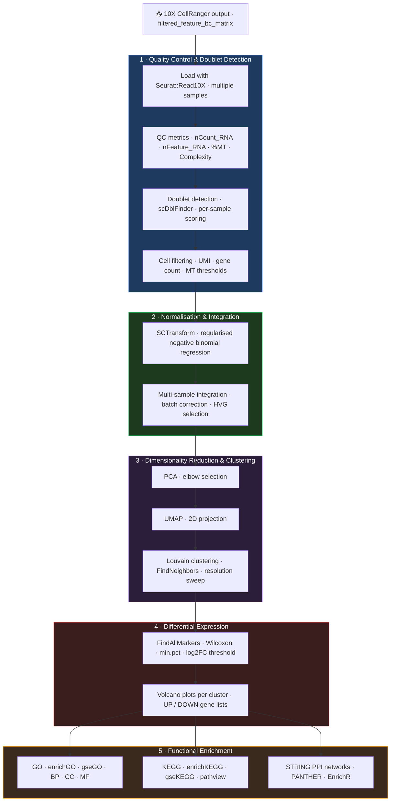

# snRNA-seq Analysis Pipeline

[](https://www.r-project.org/)
[](https://satijalab.org/seurat/)
[](https://bioconductor.org/)
[](https://rstudio.github.io/renv/)
[](#license)
[](https://slopezbegines.github.io/projects/single-cell/)

> Modular R pipeline for single-nucleus RNA-seq analysis: from 10X CellRanger output through quality control, SCTransform normalisation, clustering, differential expression, and multi-layered functional enrichment.

## Overview

End-to-end snRNA-seq pipeline built on Seurat v5. Designed for multi-sample experiments (WT vs KO), the pipeline covers every analytical stage from raw CellRanger output to publication-ready figures and pathway enrichment reports. Each stage is implemented as an independent modular script callable from RMarkdown notebooks, enabling rapid adaptation to new datasets without pipeline modification.

---

## Pipeline Architecture



---

## Repository Structure

```
.
├── README.md
├── renv.lock                          # Dependency lock file (R 4.5.2)
├── single_cell.Rproj                  # RStudio project
│
├── code/                              # Modular R scripts
│   ├── 00_packages.R                  # Dependency management (pak)
│   ├── 01_sc_functions.R              # Core QC utilities & plot export
│   ├── 02_vulcano_plots.R             # Volcano plot generation
│   ├── 03_GO.R                        # GO over-representation analysis
│   ├── 04_strings.R                   # STRING PPI network analysis
│   ├── 05_gse.R                       # GSEA (GO + KEGG ranked lists)
│   ├── 06_Heatmap.R                   # ComplexHeatmap visualisation
│   ├── 07_HeatMap_GO_types.R          # GO-category heatmaps
│   ├── 08_EnrichR.R                   # EnrichR enrichment
│   ├── 09_gseKEGG.R                   # KEGG pathway GSEA + pathview
│   ├── ABA_sc_ref.R                   # Allen Brain Atlas reference
│   ├── Clusters_splitted_libraries.R  # Per-library independent clustering
│   ├── Doublets_Finders.R             # scDblFinder doublet detection
│   └── global_variables.R             # Thresholds & organism parameters
│
├── code_claude/                       # GSE194315 adaptation (PBMC CITE-seq reference)
│   ├── global_variables_GSE194315.R   # QC thresholds, PBMC markers, hardware config
│   ├── 00_packages_GSE194315.R        # Auto-install dependency loader
│   ├── 01_sc_functions_GSE194315.R    # Checkpoint system + extended QC utilities
│   └── GSE194315_PBMC_SCT_Analysis.Rmd  # Full analysis notebook for GSE194315
│
└── rmds/                              # R Markdown analysis notebooks
    ├── README.md                      # Notebook guide — which .Rmd to use and when
    ├── Single_Cell_10X_Integrated_functions_SCT - PV_Cre-chacon22.Rmd  # ⭐ Main template
    ├── Single_Cell_10X_Integrated_functions_SCT -UBC_Cre.Rmd           # UBC-Cre template
    ├── Clustering Association_FindAllMarkers.Rmd  # Downstream: cluster annotation
    ├── Clustering Association.Rmd                 # Downstream: association analysis
    └── [legacy notebooks]             # Pre-SCTransform versions — see rmds/README.md
```

---

## R Scripts Reference

| Script | Purpose |
|---|---|
| `00_packages.R` | Install/load all dependencies via `pak` |
| `01_sc_functions.R` | `library_summary()`, `generate_qc_plots()`, `save_plot()` — QC metrics and dual-format (TIFF + PDF) export |
| `02_vulcano_plots.R` | `perform_vulcano()` — ggplot2 volcano plots with ggrepel labels per cluster |
| `03_GO.R` | `perform_enrichGO()` — clusterProfiler GO over-representation (BP, CC, MF) |
| `04_strings.R` | STRINGdb PPI network retrieval and visualisation |
| `05_gse.R` | `process_gene_list()` — GSEA ranked-list pipeline (GO + KEGG) |
| `06_Heatmap.R` | ComplexHeatmap of top DEGs per cluster |
| `07_HeatMap_GO_types.R` | GO-category-specific expression heatmaps |
| `08_EnrichR.R` | Multi-library enrichment via enrichR (GO, KEGG, Reactome, WikiPathways) |
| `09_gseKEGG.R` | `gseKEGG()` with pathview pathway diagrams |
| `Doublets_Finders.R` | scDblFinder per-sample doublet scoring and removal |
| `Clusters_splitted_libraries.R` | Independent per-sample UMAP + Louvain clustering |
| `ABA_sc_ref.R` | Allen Brain Atlas integration for cell type reference annotation |
| `global_variables.R` | Centralised thresholds: `p_val`, `FC`, `kegg_organism`, `species` |

### Configuration (`global_variables.R`)

```r
p_val          <- 0.05          # Adjusted p-value threshold
FC             <- 0.25          # log2FC threshold
kegg_organism  <- "mmu"         # KEGG organism code (configurable)
species        <- 10090         # NCBI taxonomy ID
organism       <- "org.Mm.eg.db"
keyType        <- "UNIPROT"
```

---

## Reproducing the Analysis

### 1. Restore the R environment

```r
install.packages("renv")
renv::restore()   # Restores all packages from renv.lock (R 4.5.2)
```

### 2. Run the pipeline

Open the appropriate RMarkdown notebook and set `data_path` to your CellRanger output directory:

```r
# Main analysis
rmarkdown::render("rmds/Single_Cell_10X_Integrated_functions_SCT.Rmd")
```

### 3. Run enrichment modules independently

```r
source("code/03_GO.R")       # GO over-representation
source("code/05_gse.R")      # GSEA
source("code/09_gseKEGG.R")  # KEGG pathway analysis
source("code/04_strings.R")  # STRING PPI networks
```

> Raw 10X CellRanger data and processed Seurat objects are not versioned. The `renv.lock` file fully specifies the computational environment.

---

## Example Dataset — GSE194315

The `code_claude/` scripts demonstrate full pipeline adaptation to a public reference dataset:

**Study:** Immune landscape of Psoriatic Arthritis (PSA), Psoriasis (PSO) and Healthy controls via PBMC CITE-seq.
**Reference:** Liu Y. et al. *Frontiers in Immunology* 13:835760 (2022). doi:[10.3389/fimmu.2022.835760](https://doi.org/10.3389/fimmu.2022.835760)
**GEO accession:** [GSE194315](https://www.ncbi.nlm.nih.gov/geo/query/acc.cgi?acc=GSE194315)
**Design:** 7 patients × 4 technical replicates = 28 libraries. 3 conditions: Healthy / PSA / PSO.
**Species:** *Homo sapiens* (KEGG: `hsa`, taxonomy: 9606, annotation: `org.Hs.eg.db`)

### Downloading the data

```r
# Option A — GEOquery (recommended)
BiocManager::install("GEOquery")
GEOquery::getGEOSuppFiles("GSE194315", baseDir = "rawdata/")

# Option B — Direct download from GEO FTP
# https://ftp.ncbi.nlm.nih.gov/geo/series/GSE194nnn/GSE194315/suppl/
# Download: GSE194315_PBMC-01-07_processed_data_files.tar.gz
# Decompress into rawdata/GSE194315/
```

After download, the directory structure expected by `code_claude/global_variables_GSE194315.R`:

```
rawdata/GSE194315/
├── GSE194315_PBMC-01-07_processed_data_files/
│   ├── PBMC-01-1.barcodes.tsv.gz
│   ├── PBMC-01-1.features.tsv.gz
│   ├── PBMC-01-1.matrix.mtx.gz
│   └── ...  (28 libraries × 3 files)
├── GSE194315_CellMetadata-AS_TotalCiteseq_*.tsv
└── GSE194315_StudyInfo_*.xlsx
```

> Raw data is gitignored (`rawdata/` excluded). Only analysis code is versioned.

---

## QC Thresholds

Thresholds must be tuned per tissue type. The values below are defaults for **human PBMCs** (from `code_claude/global_variables_GSE194315.R`) and serve as starting-point reference.

| Metric | Parameter | Default (PBMC) | Notes |
|---|---|---|---|
| Min genes per cell | `QC_MIN_FEATURES` | 200 | Below this → empty droplet or low-quality cell |
| Max genes per cell | `QC_MAX_FEATURES` | 5 000 | Above this → likely doublet |
| Min UMI counts | `QC_MIN_COUNTS` | 500 | Below this → poor library complexity |
| Max UMI counts | `QC_MAX_COUNTS` | 25 000 | Above this → likely doublet |
| Max % mitochondrial | `QC_MAX_MT` | 20 % | PBMCs have cytoplasm → higher baseline than nuclei; brain snRNA-seq typically uses 1–5 % |
| Min complexity (log10 genes/UMI) | `QC_MIN_COMPLEXITY` | 0.80 | Novelty score; low = low-complexity / stressed cells |
| Max % ribosomal | `QC_MAX_RIBO` | 60 % | No strict lower bound; very high ribo% can indicate stressed cells |

**Tissue-specific guidance:**

- **Brain snRNA-seq (nuclei):** `QC_MAX_MT` 1–5 %, `QC_MAX_FEATURES` 3 000–4 000 (nuclei have fewer detectable genes than whole cells)
- **Tumour biopsies:** higher MT tolerance (10–25 %) due to hypoxic stress
- **Immune cells (PBMC):** standard values above apply

All thresholds are centralised in `global_variables.R` (or the dataset-specific variant). Change them there — do not hardcode values in notebooks.

---

## Computational Requirements

Benchmarked on an i7-7560U (2 physical / 4 logical cores, 16 GB RAM + 16 GB swap, Ubuntu).

| Dataset size | RAM required | Approx. runtime | Notes |
|---|---|---|---|
| < 5 000 cells | 8 GB | 20–40 min | Standard laptop feasible |
| 5 000 – 20 000 cells | 16 GB | 1–3 h | Swap may be used during integration |
| 20 000 – 50 000 cells | 32 GB | 3–8 h | HPC recommended; use `plan("multisession")` |
| > 50 000 cells | 64 GB+ | 8–24 h | HPC required; consider sketch-based methods |

**Parallelisation** is controlled in `global_variables.R`:

```r
# Sequential (safe on ≤ 16 GB RAM, protects against fork overhead)
PARALLEL_WORKERS      <- 1
FUTURE_GLOBALS_MAX_MB <- 6000   # 6 GB global size limit for {future}
plan("sequential")

# Multi-session (use on ≥ 32 GB RAM)
PARALLEL_WORKERS <- 4
plan("multisession", workers = PARALLEL_WORKERS)
```

The `code_claude/01_sc_functions_GSE194315.R` implements a **checkpoint system** that saves intermediate Seurat objects to `output/RData/checkpoint_<step>.rds`. If the session crashes mid-run, restart from the last checkpoint rather than from scratch:

```r
# Restart from a specific checkpoint
seurat_obj <- check_checkpoint("03_filtered", base = output_path)
```

---

## Troubleshooting

**`Error: cannot allocate vector of size X Gb`**

Insufficient RAM. Options: (1) reduce `N_INTEGRATION_FEATURES` from 3000 to 1500–2000; (2) switch to `plan("sequential")`; (3) process samples in batches using `Clusters_splitted_libraries.R`; (4) use sketch-based integration (`SketchIntegration` in Seurat v5).

**`Seurat v5 API errors` (e.g. `object of class Assay5 cannot be coerced`)**

Seurat v5 changed the default assay class. Fix:
```r
seurat_obj[["RNA"]] <- as(seurat_obj[["RNA"]], "Assay")  # downgrade to v4 assay
# or set globally:
options(Seurat.object.assay.version = "v3")
```

**`scDblFinder: too few cells in sample X`**

Doublet detection requires ≥ 200 cells per sample. For very small libraries, skip doublet detection or set a lower `dbr` (expected doublet rate):
```r
sce <- scDblFinder(sce, dbr = 0.05, samples = sce$library)
```

**`Harmony / RPCA integration fails`**

Common cause: too few cells in one condition after QC filtering. Check cell counts per sample before integration. If a sample has < 100 cells, consider removing it from integration or using a more lenient QC threshold.

**`clusterProfiler: keys not found in OrgDb`**

Ensure `keyType` matches the gene identifier format in your data. For human PBMC data, use `keyType <- "SYMBOL"`. For mouse data with Ensembl IDs, use `keyType <- "ENSEMBL"`.

**`renv::restore()` fails on Seurat v5**

Seurat v5 has non-CRAN dependencies. If restore fails:
```r
remotes::install_github("satijalab/seurat", "seurat5")
renv::restore()  # retry remaining packages
```

---

## Tech Stack

| Layer | Tools |
|---|---|
| Single-cell framework | Seurat v5, sctransform |
| Doublet detection | scDblFinder |
| Cell type annotation | SingleR, Azimuth, Allen Brain Atlas |
| Differential expression | FindAllMarkers (Wilcoxon), MAST |
| GO enrichment | clusterProfiler (enrichGO, gseGO) |
| KEGG analysis | clusterProfiler (enrichKEGG, gseKEGG), pathview |
| PPI networks | STRINGdb |
| Multi-database enrichment | enrichR |
| Pathway classification | rbioapi (PANTHER) |
| Visualisation | ggplot2, ComplexHeatmap, patchwork |
| Annotation | org.Mm.eg.db, biomaRt, AnnotationHub |
| Reproducibility | renv |

---

## Example Output

> Figures will be added here from the GSE194315 reference analysis once the pipeline run is complete. Expected outputs:

| Figure | Script | Description |
|---|---|---|
| UMAP coloured by cell type | `01_sc_functions.R` → `generate_qc_plots()` | 2D projection with Louvain cluster labels and annotated cell types |
| QC violin plots (before/after filtering) | `01_sc_functions.R` → `generate_qc_plots()` | nCount_RNA, nFeature_RNA, % MT per sample pre- and post-filter |
| Dotplot of canonical marker genes | Seurat `DotPlot()` | Top markers per cluster confirming cell type annotation |
| Volcano plot — condition vs. condition | `02_vulcano_plots.R` → `perform_vulcano()` | log2FC vs. −log10(p-value) per cluster, UP/DOWN genes labelled |

Figures are saved in dual format (TIFF 300 dpi + PDF) to `output/<experiment>/figures/`.

---

## Author

**Santiago López Begines, PhD**
Neuroscientist → Data Scientist
[Portfolio](https://slopezbegines.github.io/projects/single-cell/) · [GitHub](https://github.com/SLopezBegines) · [LinkedIn](https://linkedin.com/in/santibegines) · [ORCID](https://orcid.org/0000-0001-8809-8919)

---

## License

Code available for educational and research purposes with attribution. Raw sequencing data and processed results are not included.
